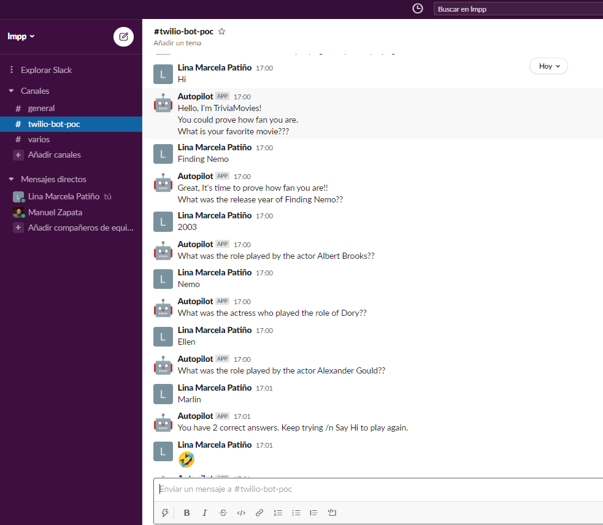
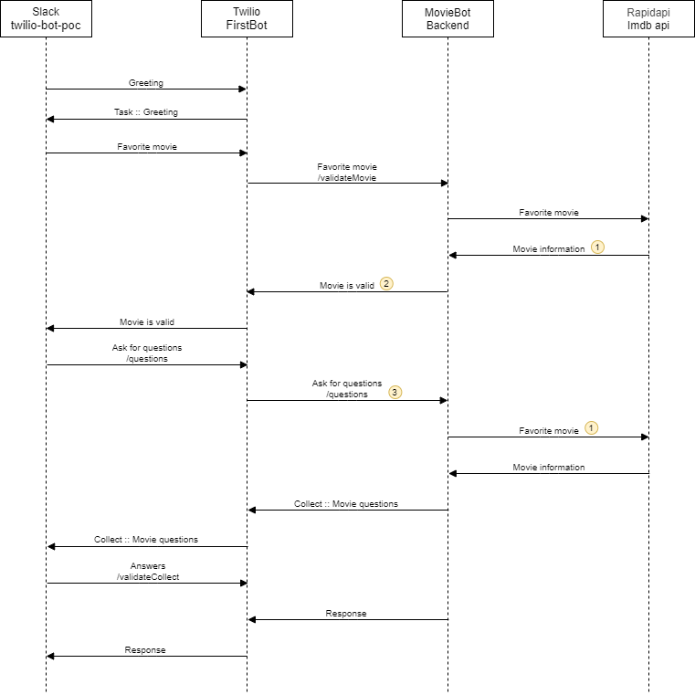

# Twilio-Autopilot

### 1. Description 

This project is a Slack Channel Bot build using Twilio Autopilot.

The idea behind MovieBot is to prove how much you know about your favorite movie. 
##### &nbsp;&nbsp;&nbsp;&nbsp; How to use
&nbsp;&nbsp;&nbsp;&nbsp; 1. You need to add this workspace ([lmpp.slack.com](https://lmpp.slack.com/archives/C01N6GC08RX)) to your Slack. \
&nbsp;&nbsp;&nbsp;&nbsp; 2. Add the channel #twilio-bot-poc.\
&nbsp;&nbsp;&nbsp;&nbsp; 3. Say Hello to MovieBot.




### 2. Restrictions
The Bot finds the movie by name consuming in the Imdb API. \
This API returns all the occurrences that contains at least one of thhe words in the movie name. \
For this reason, to facilitate the development, the Bot takes the first one as your favorite.  


### 3. Design

#### 3.1 Technologies

##### * Promagrmming lenguage
&nbsp;&nbsp;&nbsp;&nbsp; Java 11 and Spring Boot

##### * Database
&nbsp;&nbsp;&nbsp;&nbsp; H2 - Memory database

##### * Deploy
&nbsp;&nbsp;&nbsp;&nbsp; Maven and Heroku

##### * Tools
&nbsp;&nbsp;&nbsp;&nbsp; Twilio Autopilot, Slack and Imdb API provided by APIDojo.net through RapiApi


#### 3.2 Sequence diagram




#### 3.3 Twilio task

##### * First task: It is configured in the Twilio dashboard
&nbsp;&nbsp;&nbsp;&nbsp; This is the first task that it's executed by the Bot
```yaml
{
   "actions": [
      {
         "collect": {
            "name": "favorite_movie",
            "questions": [
               {
                  "question": "Hello, I'm TriviaMovies! \n You could prove how fan you are. \n What is your favorite movie???",
                  "name": "movie_name",
                  "type": "",
                  "validate": {
                     "on_failure": {
                        "messages": [
                           {
                              "say": "Sorry, that's not a valid movie."
                           },
                           {
                              "say": "Hmm, I'm not understanding."
                           }
                        ],
                        "repeat_question": true
                     },
                     "webhook": {
                        "method": "POST",
                        "url": "https://lmpp-movie-bot.herokuapp.com/v1/autopilot/validateMovie"
                     },
                     "on_success": {
                        "say": "Great, It's time to prove how fan you are!!"
                     },
                     "max_attempts": {
                        "redirect": "task://having-trouble",
                        "num_attempts": 3
                     }
                  }
               }
            ],
            "on_complete": {
               "redirect": {
                  "method": "POST",
                  "uri": "https://lmpp-movie-bot.herokuapp.com/v1/autopilot/questions"
               }
            }
         }
      }
   ]
}
```

##### * Second task: It is generated dynamically in the code
&nbsp;&nbsp;&nbsp;&nbsp; This is the second task that it's executed by the Bot.\ 
&nbsp;&nbsp;&nbsp;&nbsp; The question are generated using the movie information obtained through the Imdb API.
```yaml
{
   "actions":[
      {
         "collect":{
            "name":"collect_tt0266543",
            "questions":[
               {
                  "question":"What was the release year of Finding Nemo??",
                  "name":"year_question_2003",
                  "type":""
               },
               {
                  "question":" What was the role played by the actor Albert Brooks??",
                  "name":"role_question_Marlin",
                  "type":""
               },
               {
                  "question":"What was the actress who played the role of Dory??",
                  "name":"actor_question_Ellen DeGeneres",
                  "type":""
               },
               {
                  "question":" What was the role played by the actor Alexander Gould??",
                  "name":"role_question_Nemo",
                  "type":""
               }
            ],
            "on_complete":{
               "redirect":"https://lmpp-movie-bot.herokuapp.com/v1/autopilot/validateCollect/"
            }
         }
      }
   ]
}
```

### 4. Endpoints

Yo could access to  the endpoint in the swagger page
https://lmpp-movie-bot.herokuapp.com/swagger-ui/index.html


